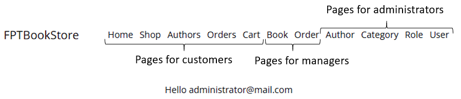
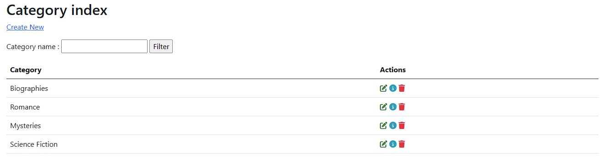
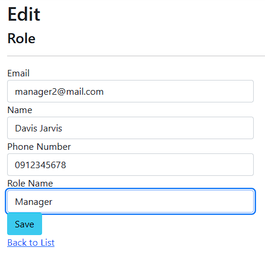

# Book Store application description

## 1. Use case

**Manager** can manage books as well as view and confirm orders. **administrator** can also manage managers, view and delete users, authors, and categories. **Users** can sign up, log in and change password of their account, they can also view the books that are available in the system as well as puchase books and view ongoing or past orders in their account.

<p align="center">
    
</p>

## 2. Database

The application uses SQL Server LocalDB as its database. The design of the database is as follows.

<p align="center">
    
</p>

## 3. System access

The system can be accessed as

- An administrator with
```
{
    "username": "administrator@mail.com"
    "password": "123"
}
```

- A manager with 
```
{
    "username": "manager@mail.com"
    "password": "123"
}
```

- A customer with
```
{
    "username": "customer@mail.com"
    "password": "123"
}
```

## 4. Pages

### 4.1. Admin pages

When logged in to manager, the system will show links for managers to manage books and or orders as shown below.

<p align="center">
    
</p>

Logging in as administrator also show other links for administrators.

<p align="center">
    
</p>

A manager account can access to book and order pages through the system.

<p align="center">
    
</p>
<p align="center">Book index page</p>

<p align="center">
    
</p>
<p align="center">Order index page</p>

An administrator can access to category, author, role, and user management pages through the system.

<p align="center">
    
</p>
<p align="center">Author index page</p>

<p align="center">
    
</p>
<p align="center">Category index page</p>

<p align="center">
    
</p>
<p align="center">Role index page</p>

<p align="center">
    
</p>
<p align="center">User index page</p>

Only administrator can create a new author in the following page.

<p align="center">
    
</p>

Both administrator and manager can add a new book in the following page. The book create page will take data from category and author tables in the database to put in a drop down box so that the user can choose the author and category easily.

<p align="center">
    
</p>

Only administrator can add new managers to the system. To do that, first the manager needs to register a new account which will appear as a customer account.

<p align="center">
    
</p>

Then the administrator needs to edit the role of that account and change it to manager.

<p align="center">
    
</p>

Then the account will be treated as a manager account.

<p align="center">
    
</p>

In the order page, the managers can tell the customers that their orders are being shipped by pressing the Ship order button.

<p align="center">
    
</p>

As you can see from the above picture, the order status changed from "Pending" to "Shipping" on the customer end when pressing the ship order button. From their, the customer can press "Received" button when the order arrives and the system will update that information to the manager side.

<p align="center">
    
</p>

### 4.2. Customer pages

This is the homepage for the customer where they will be directed after logging in or signing up.

<p align="center">
    
</p>

The next page is shop page where all the books in the system will be shown to the customer.

<p align="center">
    
</p>

When clicking on a book, the customer can see its details.

<p align="center">
    
</p>

The customers can click on "Add to cart" button when they want to purchase a book. By doing that, they will be directed to the cart page showing them all the books that they chose, along with the quantity of each book and a total of the products in the cart.

<p align="center">
    
</p>
 
 Clicking on "Buy now" button will place the order with the address and phone number entered in the cart page.

<p align="center">
    
</p>

Placing order will show the new order for the manager as well as reduce the number of that book in stock.

<p align="center">
    
</p>

## 5. Technologies

- The application was developed in Microsoft Visual because our team were more familiar with the tool and its ability to quickly and accurately complete code.

- The design pattern was MVC architecture due to its Separation of Concerns nature and our familiarity with this architecture from many previous projects.

- The application was developed in C# environment and ASP.NET framework due to their flexibility and simple syntax as well as a huge community to ask from.

- The version control system (VCS) was GitHub to store and share our code between the members of the team because we were familiar with this technology from previous projects.

- The database for this application was SQL Server LocalDb which is integrated into Visual Studio so that we can easily access the database when working on the IDE.

#### More information on how we planned and implemented this application as well as difficulties we faced can be found [HERE](https://drive.google.com/file/d/1HdDOT6qGC6n75hzU_B4T7wkXkQA5oYRZ/view?usp=sharing).